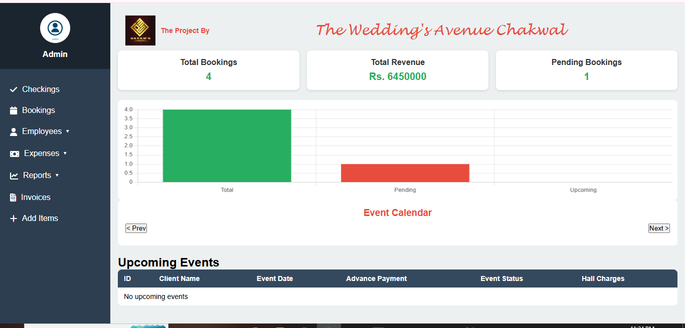
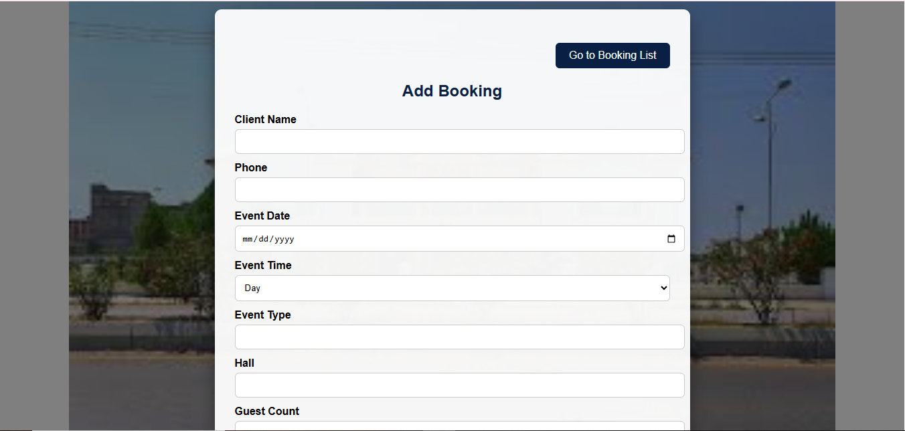
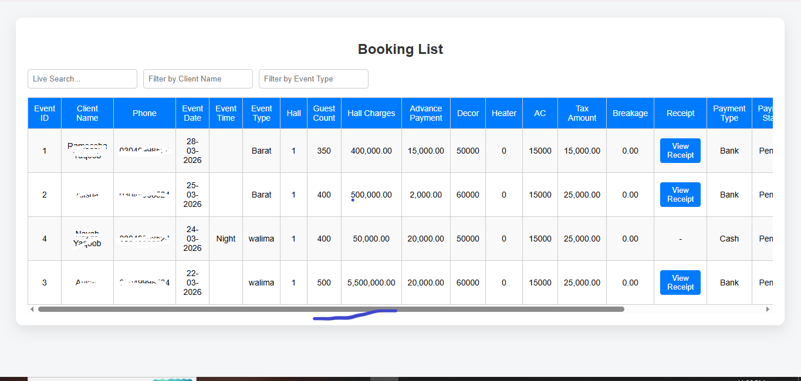
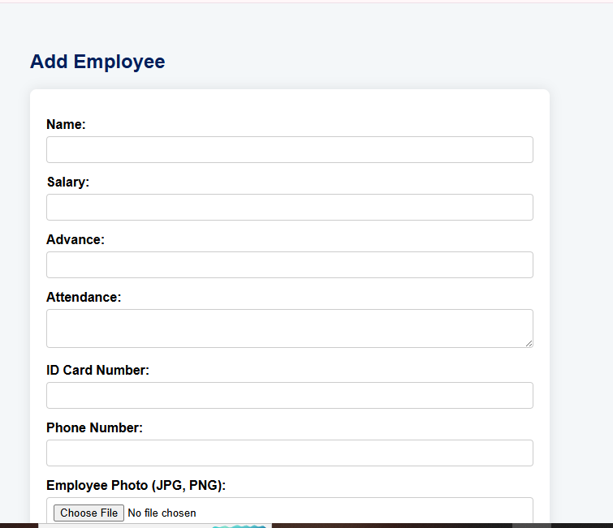
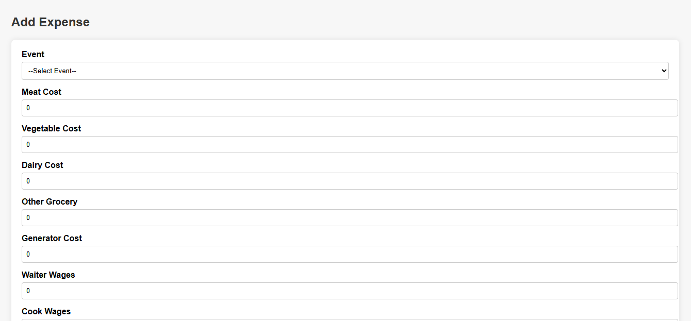
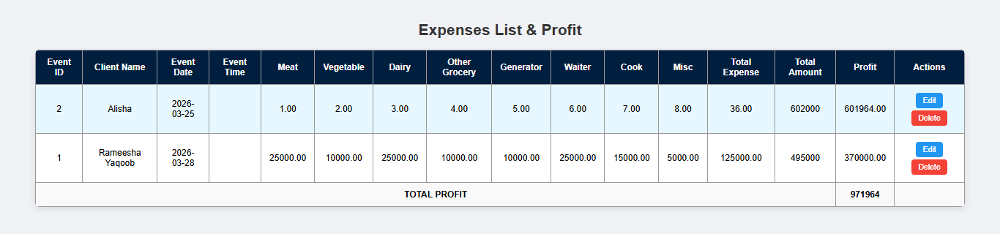
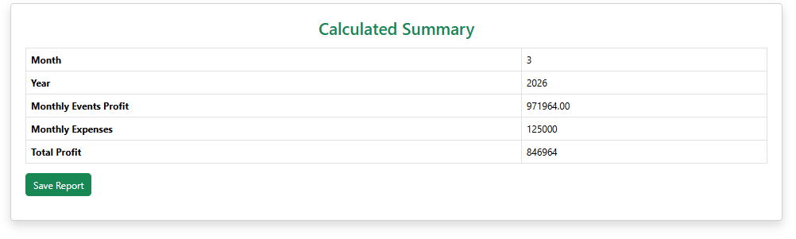
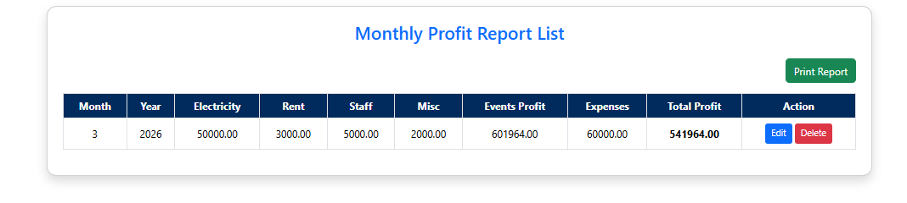

# Wedding Hall Management System

## Project Overview

Wedding Hall Management System is a web-based application developed to manage wedding hall operations efficiently. This system helps administrators manage bookings, employees, attendance, expenses, and profit reports through an organized management interface.

## Features

- Admin Login System
- User Management
- Wedding Hall Booking Management
- Booking List Management
- Employee Management
- Employee Attendance Tracking
- Expense Management
- Expense List Management
- Monthly Expense Tracking
- Monthly Profit Report Generation
- Calculated Summary Reports
- MySQL Database Integration

## Technologies Used

- PHP
- HTML5
- CSS3
- JavaScript
- MySQL
- XAMPP

## Database

The project database file is included in this repository:

`wedding_system.sql`

## Screenshots

### Dashboard

### Add Booking

### Booking List

### Add Employee

### Add Expense

### Expense List

### Calculated Summary

### Monthly Profit Report

## How to Run the Project

1. Install XAMPP server.
2. Copy the project folder into the `htdocs` directory.
3. Start Apache and MySQL from XAMPP Control Panel.
4. Open phpMyAdmin.
5. create a database named:
6. Import the provided `wedding_system.sql` file.
7. Open the project in your browser:
8. http://localhost/wedding_system/dashboard.php
   
## Author

**Rameesha Yaqoob**

## License

This project is for educational and portfolio purposes.

7. Create a database named:

